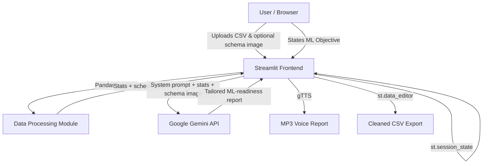

```
██████╗  █████╗ ████████╗ █████╗  ██████╗ ██╗   ██╗ █████╗ ██████╗ ██████╗
██╔══██╗██╔══██╗╚══██╔══╝██╔══██╗██╔════╝ ██║   ██║██╔══██╗██╔══██╗██╔══██╗
██║  ██║███████║   ██║   ███████║██║  ███╗██║   ██║███████║██████╔╝██║  ██║
██║  ██║██╔══██║   ██║   ██╔══██║██║   ██║██║   ██║██╔══██║██╔══██╗██║  ██║
██████╔╝██║  ██║   ██║   ██║  ██║╚██████╔╝╚██████╔╝██║  ██║██║  ██║██████╔╝
╚═════╝ ╚═╝  ╚═╝   ╚═╝   ╚═╝  ╚═╝ ╚═════╝  ╚═════╝ ╚═╝  ╚═╝╚═╝  ╚═╝╚═════╝

                   🛡️  AI  |  MULTI-MODAL DATA-QUALITY & ML-READINESS STUDIO
```

> **MirAI School of Technology Capstone Project** — Category D: Productivity & Enterprise Automation
> **Live Demo:** [dataguard-ai-titvzta9necybkrd4njqlq.streamlit.app](https://dataguard-ai-titvzta9necybkrd4njqlq.streamlit.app/)
> **Repository:** [github.com/samudralasreelasya/DataGuard-AI](https://github.com/samudralasreelasya/DataGuard-AI)

---

```bash
$ whoami
Samudrala Sreelasya — B.Tech Capstone, MirAI School of Technology

$ cat mission.txt
Validate, audit, and profile CSV datasets before they hit an ML pipeline —
with a real Gemini model doing the reasoning, not a hardcoded template.
```

---

## 📡 `> overview`

**DataGuard AI** is a Streamlit dashboard that ingests a CSV, profiles it with Pandas
(missing values, duplicates, memory footprint), lets you clean it interactively with
`st.data_editor`, and then hands a live **Gemini** model the real dataset statistics
plus an optional schema-screenshot to produce a tailored **ML-readiness audit** —
not a canned response. The audit can also be converted to speech via `gTTS`.

```bash
$ ./run_pipeline.sh
[1/5] Ingest CSV ................ done
[2/5] Profile with Pandas ....... done
[3/5] Build prompt from stats ... done
[4/5] Call gemini-2.5-flash ..... done
[5/5] Render report + audio ..... done
```

---

## ✨ `> features`

| # | Feature | Implementation |
|---|---------|-----------------|
| 1 | Interactive data ingestion & profiling | `pandas` — rows, columns, missing cells, duplicate rows |
| 2 | Live keyword search + inline editing | `st.data_editor` with a `.str.contains()` mask across all columns |
| 3 | KPI cards with deltas | `st.metric()` comparing current vs. previous run of the same dataset |
| 4 | Missing-value visualization | `plotly.express` bar chart, theme-aware |
| 5 | **Real Gemini AI audit** | `google-genai` — system-prompted, dataset-grounded, model-selectable |
| 6 | **Multimodal schema understanding** | Uploaded schema/data-dictionary image passed directly into `generate_content()` |
| 7 | Voice audit playback | `gTTS` converts the AI report to MP3, played in-browser |
| 8 | Session persistence | `st.session_state` — theme, login, per-dataset audit history |
| 9 | Cleaned dataset export | `st.download_button` — CSV, post-edit |

---

## 🧠 `> ai_integration`

Unlike a static templated response, every audit is grounded in the dataset actually
uploaded:

```python
system_instruction = (
    "You are DataGuard AI, a senior ML data-readiness auditor... "
    "Always cover completeness, duplicate/leakage risk, class imbalance, "
    "preprocessing recommendations, and an overall readiness verdict."
)

user_prompt = f"""
ML Objective: {objective}
Rows: {stats['total_rows']:,} | Columns: {stats['total_cols']}
Missing cells: {stats['missing_cells']:,} | Duplicates: {stats['duplicate_rows']:,}
Schema: {schema_summary}
"""

client = genai.Client(api_key=GEMINI_API_KEY)
response = client.models.generate_content(
    model=model_id,
    contents=[user_prompt, schema_image],  # multimodal
    config=types.GenerateContentConfig(system_instruction=system_instruction),
)
```

- **Model selector** maps to real, callable Gemini model IDs (`gemini-2.5-flash`,
  `gemini-3.6-flash`) — no decorative options. Gemini 1.5 was shut down by Google
  in 2026, so it's intentionally excluded.
- **Vision input**: an uploaded schema screenshot is sent alongside the text prompt
  so Gemini can read column semantics directly off the image.
- **Error handling**: rate limits (HTTP 429), bad/missing API keys, and deprecated
  model IDs are caught and surfaced as a clean `st.error()`, not a stack trace.

---

## 🏗️ `> system_architecture`



**Data flow:** CSV → Pandas profiling → prompt assembly (stats + column schema +
objective) → Gemini `generate_content()` (text, optionally + image) → rendered
report → optional TTS → optional cleaned-CSV export. Every stage after ingestion is
driven by the actual uploaded data — nothing is precomputed or mocked.

---

## 🛠️ `> tech_stack`

```
Python 3.10+
Streamlit            → frontend & state management
Pandas / NumPy       → data processing & profiling
Plotly               → interactive charts
google-genai          → Gemini text + vision inference
gTTS                 → text-to-speech
Pillow               → schema image handling
```

---

## ⚙️ `> local_setup`

```bash
# 1. clone
git clone https://github.com/samudralasreelasya/DataGuard-AI.git
cd DataGuard-AI

# 2. virtual environment
python -m venv .venv
.venv\Scripts\activate        # Windows
# source .venv/bin/activate   # macOS/Linux

# 3. install dependencies
pip install -r requirements.txt

# 4. set your Gemini API key (get one at aistudio.google.com)
set GEMINI_API_KEY=your_actual_api_key_here      # Windows CMD
# export GEMINI_API_KEY=your_actual_api_key_here # macOS/Linux

# 5. run
python -m streamlit run app.py
```

**On Streamlit Community Cloud**, don't set an env var — add the key under
**Settings → Secrets**:

```toml
GEMINI_API_KEY = "your_actual_api_key_here"
```

The app checks `st.secrets` first and falls back to the environment variable, so
the same code runs identically locally and in the cloud.

---

## 🧩 `> capstone_design_notes`

```bash
$ grep -r "session_state" app.py | wc -l
# → persists theme, auth, and per-dataset audit history across every rerun

$ grep -r "st.form" app.py | wc -l
# → gates both auth and the Gemini call behind explicit submit,
#   preventing an API call on every keystroke/widget interaction

$ grep -r "try:" app.py | wc -l
# → wraps CSV loading and the Gemini call so a bad file or a rate
#   limit shows a friendly st.error() instead of a crash
```

---

## 📥 `> deployment`

Deployed on **Streamlit Community Cloud**:
👉 **https://dataguard-ai-titvzta9necybkrd4njqlq.streamlit.app/**

`requirements.txt` is pinned to only the packages actually imported in `app.py` —
no unused system-dependent libraries, to keep the cloud build clean and fast.

---

```
© 2026 Samudrala Sreelasya | MirAI School of Technology Capstone
```