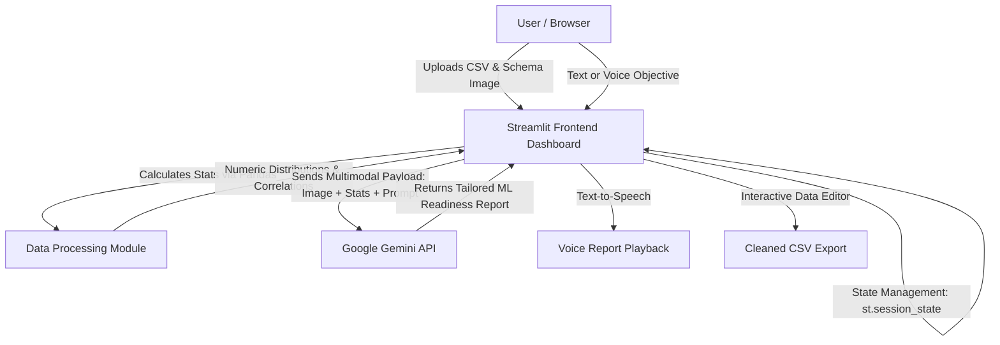

# 🛡️ DataGuard AI | Multi-modal Data Collection & ML-Readiness Studio

> **MirAI School of Technology Capstone Project (Category D: Productivity & Enterprise Automation)**
> **Live Demo:** [https://dataguard-ai-titvzta9necybkrd4njqlq.streamlit.app/]
> **Repository:** [samudralasreelasya/DataGuard-AI](https://github.com/samudralasreelasya/DataGuard-AI)

---

## 🚀 Overview
**DataGuard AI** is a sophisticated multi-modal data quality and machine learning readiness tool built with **Streamlit**, **Pandas**, **Plotly**, and **Google Gemini AI**. It gives developers, data scientists, and analysts the ability to validate, audit, and profile CSV files before using them for ML training or RAG systems — end to end, from raw upload to a cleaned, exportable dataset and a spoken ML-readiness audit.

---

## ✨ Key Features

1. **Login / Sign Up** — simple session-based auth screen gating access to the studio.
2. **📤 Upload CSV tab** — upload a raw CSV (up to 500MB) or load a bundled sample dataset (Telco Customer Churn).
3. **🧹 Clean Data tab** — search/filter across every column, edit values live with `st.data_editor`, and export the cleaned dataset as CSV.
4. **🤖 AI Audit tab**:
   - **Prompt Library** — one-click example prompts for common audit scenarios.
   - **🎙️ Voice-to-Text prompts** — record your audit objective out loud instead of typing it; transcribed automatically via `speech_recognition`.
   - **Multimodal Gemini Audit** — combines dataset statistics, an optional schema/data-dictionary image, and your objective into a structured ML-readiness report.
   - **🔊 Voice Synthesis** — have the finished report read aloud with one click (`gTTS`), handy for presenting to a client.
5. **📊 Health Overview tab** — KPI tiles (rows, features, missing cells, duplicates) and a missing-values distribution chart.
6. **📁 Sidebar dataset & prompt history** — every dataset uploaded and every AI Audit prompt/run submitted for it, always visible while you work.
7. **Dark / Light theme toggle** — fully wired across the app shell, sidebar, cards, inputs, and buttons (not just decorative — every surface actually re-themes).

## 🛠️ System Architecture Diagram


## ⚙️ Tech Stack & Dependencies
- Python 3.10+
- Streamlit (interactive frontend UI, tabs, session state)
- Pandas & NumPy (data processing & memory optimization)
- Plotly (interactive visualizations & missing-value charts)
- Google Generative AI SDK (`google-generativeai`) — ⚠️ deprecated upstream, see note below
- gTTS (text-to-speech voice report synthesis)
- SpeechRecognition + streamlit-audiorecorder + pydub (voice-to-text prompt input)
- imageio-ffmpeg (bundles ffmpeg for audio conversion — no system install required)
- Pillow (PIL) (schema image handling)

> **Note:** `google-generativeai` has been deprecated by Google in favor of `google-genai`. The live Gemini call in `src/ai_engine.py` is still a stub (returns a formatted report from dataset stats) — wiring in the real API call is a good next step, ideally on the new SDK.

## 🚀 Local Installation & Setup
1. **Clone the repository:**
   ```bash
   git clone https://github.com/samudralasreelasya/DataGuard-AI.git
   cd DataGuard-AI
   ```
2. **Create and activate a virtual environment (recommended):**
   ```bash
   python -m venv .venv
   .venv\Scripts\activate   # Windows PowerShell/CMD
   ```
3. **Install dependencies:**
   ```bash
   pip install -r requirements.txt
   ```
4. **Set your Gemini API key:**
   ```bash
   set GEMINI_API_KEY=your_actual_api_key_here
   ```
5. **Run the application:**
   ```bash
   python -m streamlit run app.py
   ```

## ☁️ Deploying to Streamlit Community Cloud
1. Push `app.py`, `src/audio_utils.py`, `requirements.txt`, and `packages.txt` to this repo.
2. Go to [share.streamlit.io](https://share.streamlit.io), sign in with GitHub, and create a new app from this repository (`main` branch, `app.py`).
3. Under **Advanced settings → Secrets**, add:
   ```toml
   GEMINI_API_KEY = "your_actual_api_key_here"
   ```
4. Deploy. `packages.txt` (containing `ffmpeg`) ensures the voice features work in the cloud environment, on top of the bundled `imageio-ffmpeg` fallback.

## 🧠 Key Features of Capstone Design
- **Preservation of Session State**: Uses `st.session_state` to persist the active dataset, profiling data, and AI reports across tab switches and widget interactions.
- **Minimizing Unnecessary Requests**: Uses `st.form` to batch inputs and avoid firing a Gemini request on every keystroke.
- **Exception Handling**: Built-in handling for CSV parse errors, empty prompts, and unrecognized speech input, so the UI degrades gracefully instead of crashing.
- **Fully wired theming**: Color tokens for dark/light mode are applied consistently across every surface — background, sidebar, cards, metric tiles, inputs, and buttons — rather than defined but unused.

---
© 2026 Samudrala Sreelasya | MirAI School of Technology Capstone